# Company Leverage Segmentation

Segmentación de empresas por perfil de apalancamiento financiero usando **K-Means** y **Extremality Multiple Kernel Learning (EMKL)**.

Dataset: 10,000 empresas más grandes del país — 40,000 registros (4 años de corte: 2021–2024).

---

## Resultados

| Método | Silhouette | Accuracy | F1 |
|---|---|---|---|
| K-Means estándar | 0.5736 | 0.5034 | 0.4762 |
| EMKL (Kernel K-Means) | 0.1809 | 0.4974 | 0.3796 |

> K-Means domina en este caso porque EMKL trabaja sobre una muestra de 5,000 empresas
> (limitación de memoria — ver sección [Por qué se samplea](#por-qué-se-samplea)).

---

## Estructura del proyecto

```
company-leverage-segmentation/
├── config.py              ← rutas, columnas y parámetros
├── main.py                ← orquestador del pipeline
├── pipeline/
│   ├── transformers.py    ← limpieza, features, outliers, escalado
│   ├── clustering.py      ← KMeans, KernelKMeans, EMKLClusterer
│   ├── evaluation.py      ← corrección de etiquetas y métricas
│   └── plots.py           ← todas las gráficas
├── extremalitymkl/        ← algoritmo EMKL (pesos por extremalidad)
├── src/                   ← métricas de kernel y kernels débiles
├── data/                  ← CSV original (no versionado)
├── out/                   ← outputs generados (no versionado)
├── requirements.txt
└── .gitignore
```

---

## Instalación

```bash
# 1. Clonar el repositorio
git clone <url-del-repo>
cd company-leverage-segmentation

# 2. Crear entorno virtual
python -m venv .env
.env\Scripts\activate        # Windows
# source .env/bin/activate   # Linux/Mac

# 3. Instalar dependencias
pip install -r requirements.txt
```

---

## Configuración

Antes de correr, verifica que `config.py` apunte al CSV correcto:

```python
FILE_PATH = os.path.join(os.path.dirname(os.path.abspath(__file__)),
                         "data", "10.000_Empresas_mas_Grandes_del_País_20260210.csv")
```

Parámetros ajustables:

```python
K_FINAL          = 3      # número de clusters
EMKL_NUM_KERNELS = 30     # kernels débiles generados
EMKL_SAMPLE_SIZE = 5_000  # muestra para EMKL (sube si tienes más RAM)
```

---

## Cómo correrlo

```bash
python main.py
```

La ejecución completa toma aproximadamente **3–5 minutos**.
La sección más lenta es EMKL (sección 5), que puede tardar 1–2 minutos en la propagación KNN.

### Salida esperada en consola

```
============================================================
1. CARGA DE DATOS
============================================================
  Filas: 40,000  |  Columnas: 14

============================================================
2. EDA
============================================================
  [OK] eda_01_distribucion_empresas.png
  ...

============================================================
5. EXTREMALITY MKL
============================================================
  [EMKL] Dataset grande (38,535 filas). Usando muestra de 5,000 para construir kernels.
  [EMKL] Propagando etiquetas al dataset completo (38,535 filas) ...

============================================================
RESUMEN COMPARATIVO
============================================================
  Método                   Silhouette   Accuracy       F1
  K-Means                      0.5736     0.5034   0.4762
  EMKL (natural)               0.1809     0.4974   0.3796
  Pipeline completo FINALIZADO.
```

Todos los outputs se guardan en `out/`.

---

## Pipeline

```
CSV
 │
 ├─ MonetaryCleaner          limpia "$1,234" → float
 ├─ LeverageFeatureEngineer  construye 7 ratios de apalancamiento
 ├─ OutlierIQRRemover        elimina extremos (IQR × 5)
 └─ LogModulusScaler         log-modulus + RobustScaler
          │
          ├─── K-Means (K=3)
          │
          └─── EMKL
                ├─ 30 kernels polinomiales débiles (muestra 5,000)
                ├─ Pesos por extremalidad (alignment + FSM)
                ├─ Kernel K-Means sobre kernel combinado
                └─ Propagación KNN al dataset completo
```

### Features de apalancamiento

| Feature | Fórmula |
|---|---|
| `deuda_activos` | Pasivos / Activos |
| `deuda_patrimonio` | Pasivos / \|Patrimonio\| |
| `multiplicador_cap` | Activos / \|Patrimonio\| |
| `cobertura_ingresos` | Ingresos Operacionales / Pasivos |
| `margen_neto` | Ganancia / \|Ingresos\| |
| `roa` | Ganancia / Activos |
| `roe` | Ganancia / \|Patrimonio\| |

### Perfiles resultantes (K-Means)

| Cluster | Perfil | Empresas |
|---|---|---|
| 0 | Apalancamiento Medio | 25,878 |
| 1 | Bajo Apalancamiento | 5,978 |
| 2 | Alto Apalancamiento | 6,679 |

---

## Outputs

### EDA

**Distribución por año y macrosector**
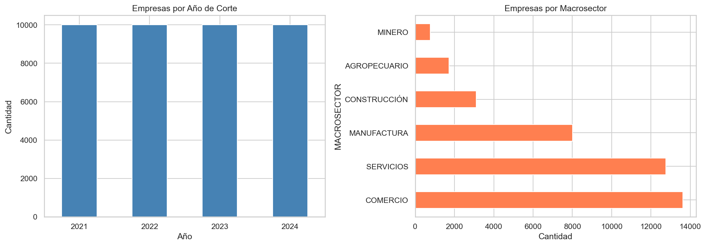

**Distribución de variables financieras (escala log)**
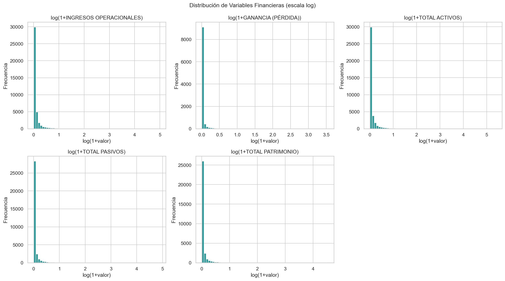

**Ratio Pasivos/Activos por macrosector**
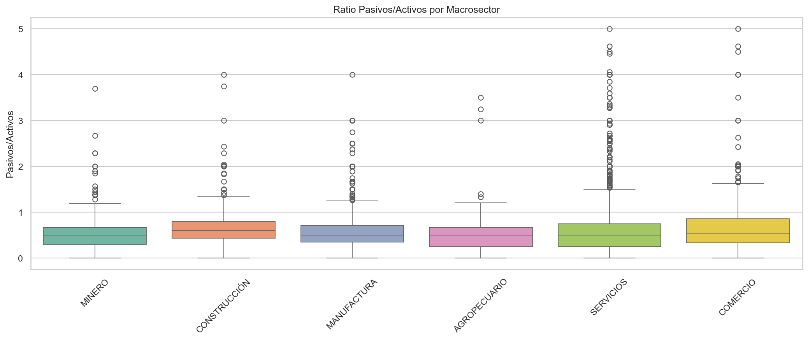

**Correlación entre variables financieras**
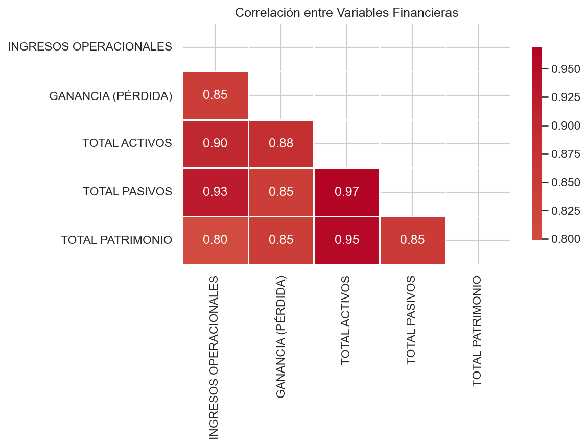

**Evolución temporal de activos, pasivos y patrimonio**
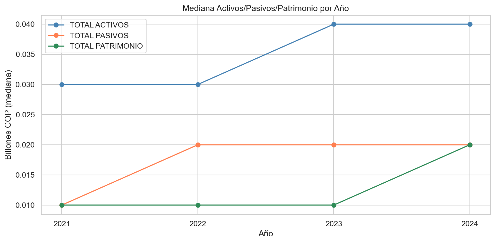

---

### Preprocesamiento

**Distribuciones post log-modulus + RobustScaler**
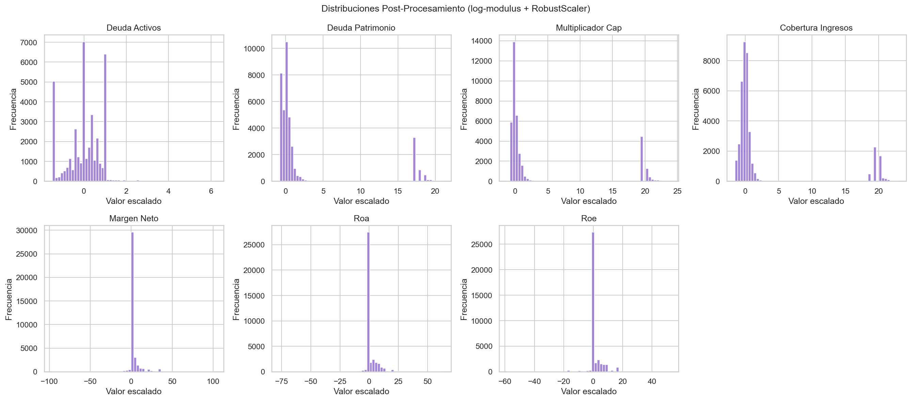

**Pairplot de features de apalancamiento**
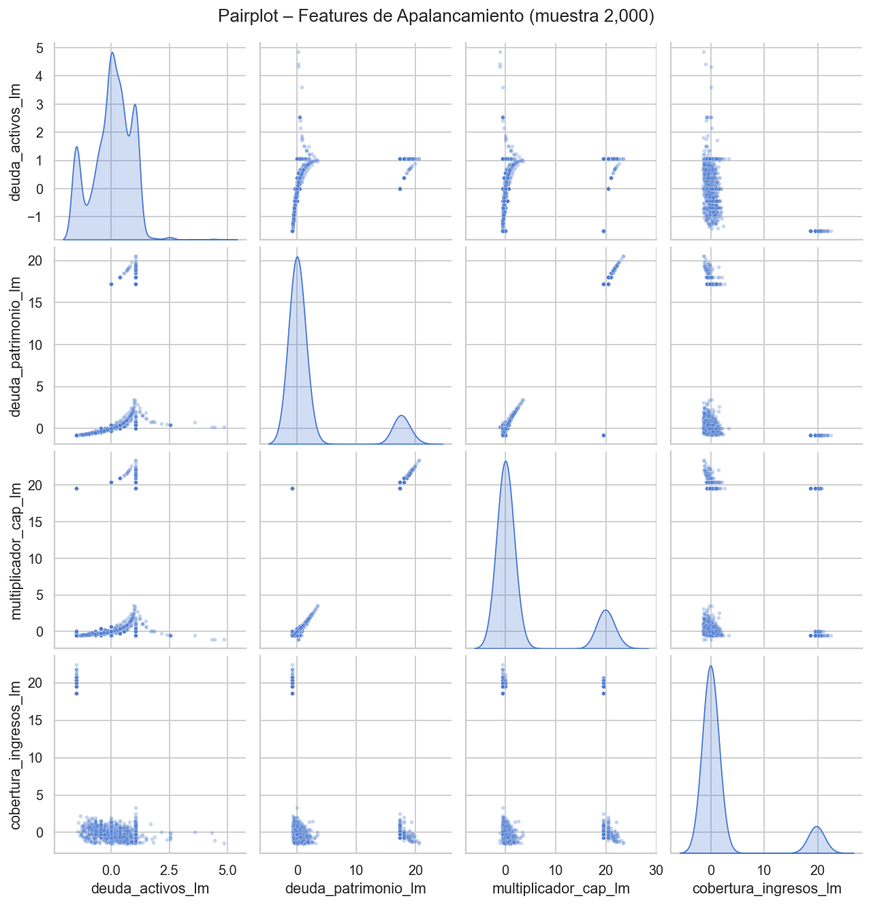

**Correlación entre features procesadas**
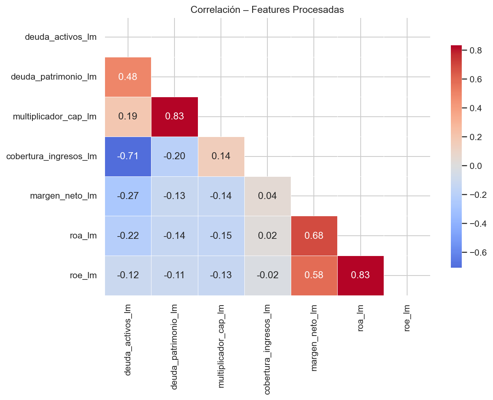

---

### Clustering K-Means

**Selección de K óptimo (codo + silhouette)**
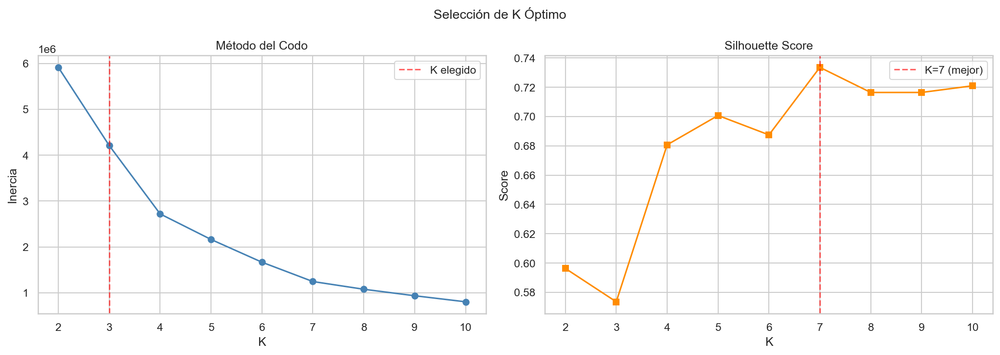

**Análisis silhouette por cluster**
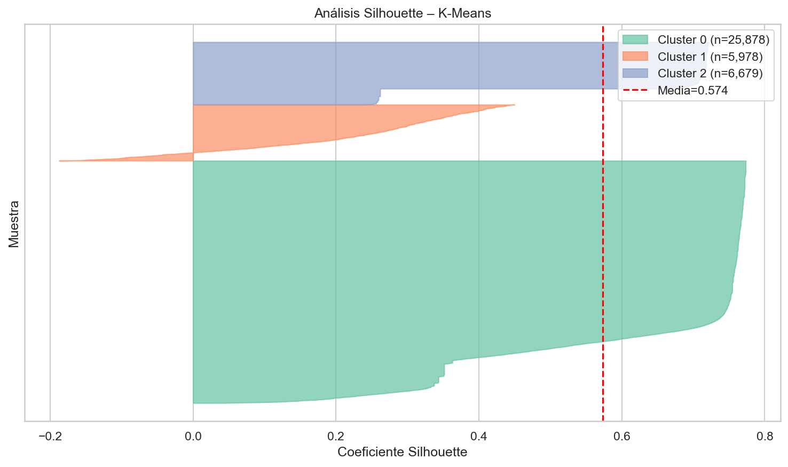

**Perfil de clusters — mediana de ratios**
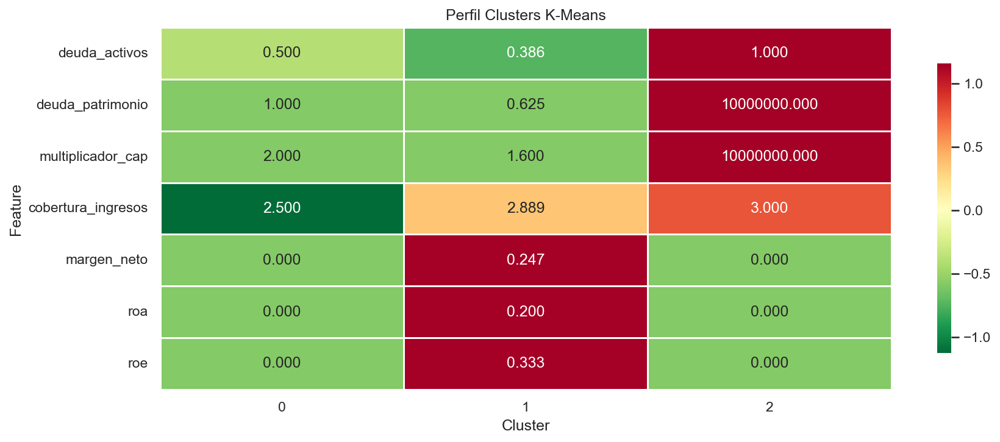

**Distribución de clusters por macrosector**
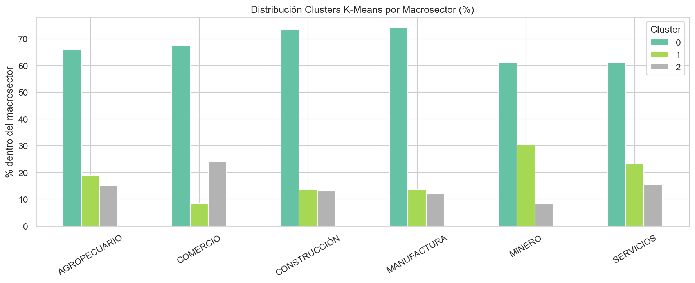

---

### EMKL

**Distribución de pesos naturales y anti-naturales**
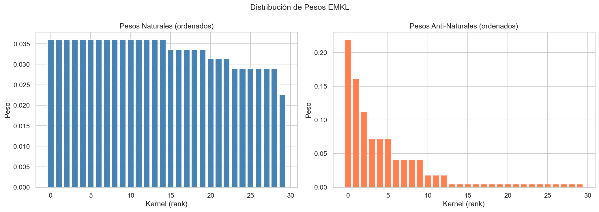

**Heatmap del kernel combinado (natural vs anti-natural)**
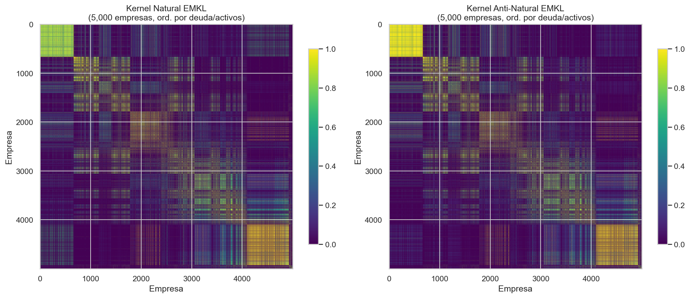

**Perfil de clusters EMKL**
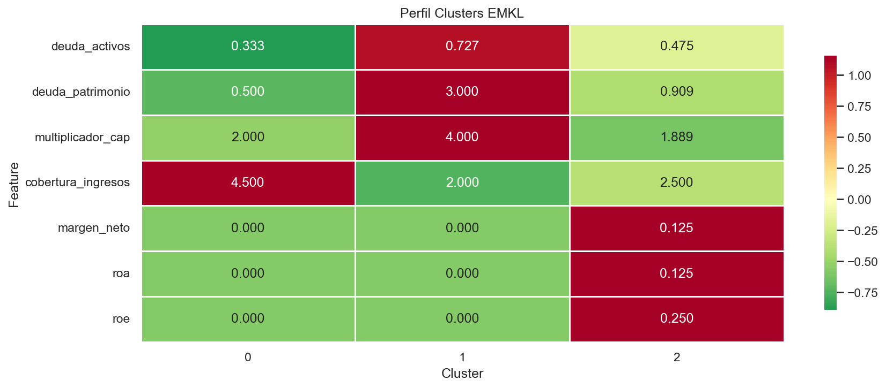

**Distribución EMKL por macrosector**
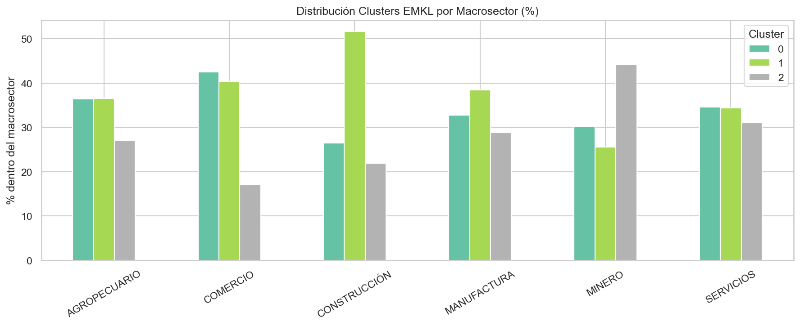

---

### Evaluación comparativa

**K-Means vs EMKL — métricas con corrección de etiquetas**
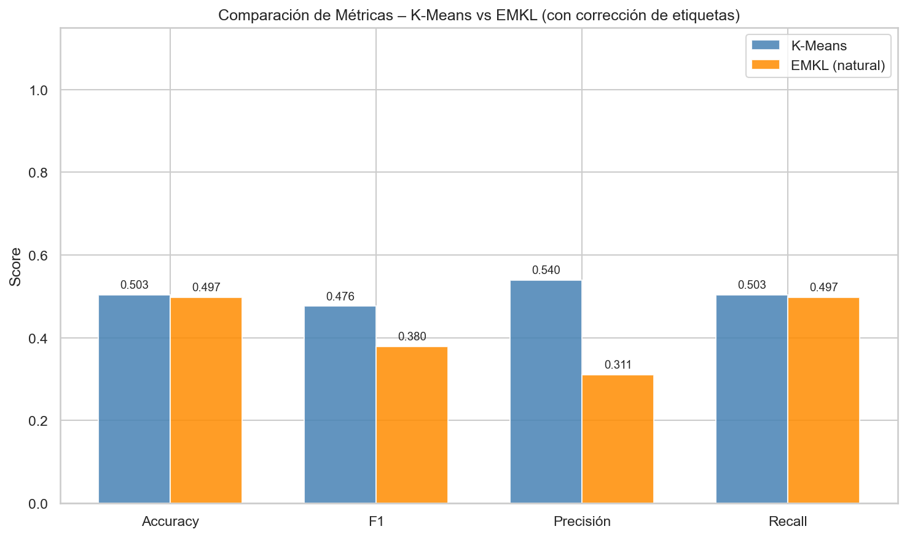

**Matrices de confusión**
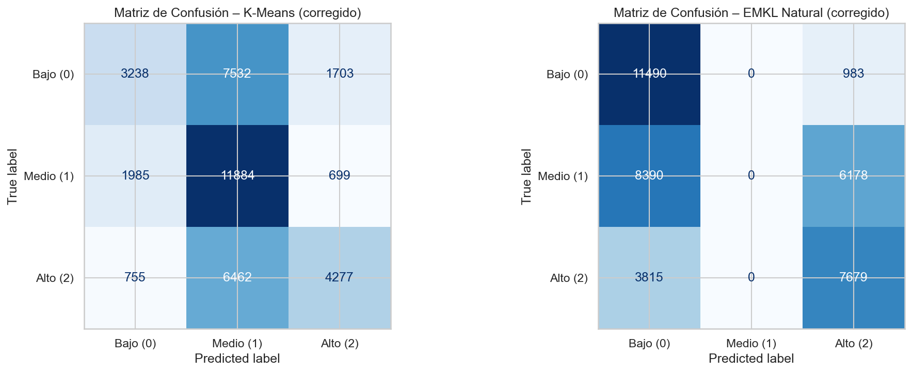

**Comparación PCA: K-Means vs EMKL**
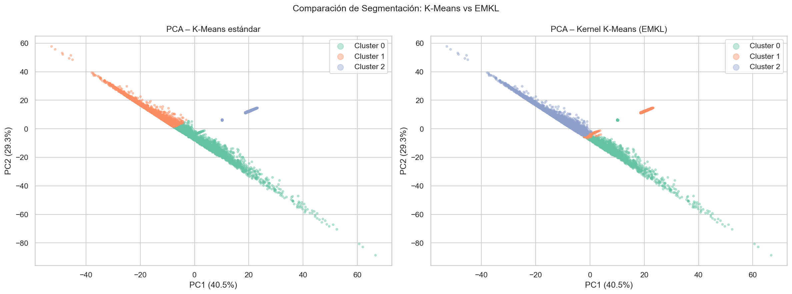

**Evolución temporal de clusters por año**
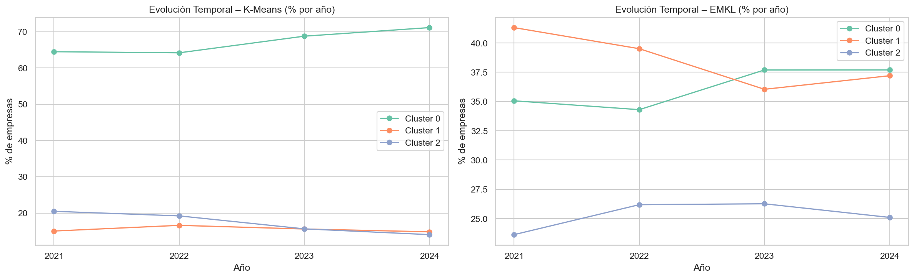

---

## Por qué se samplea

Los kernels son matrices de similitud de forma `(n, n)`. Con 38,535 empresas:

```
38,535 × 38,535 × 8 bytes = 11.1 GB  por kernel
                           × 30      = 333 GB en total
```

Esto excede cualquier RAM doméstica. La solución es aprender los pesos de extremalidad
sobre una muestra de 5,000 empresas y propagar las etiquetas al resto mediante KNN (5 vecinos).

Para mejorar la calidad de EMKL con más recursos:

```python
# config.py
EMKL_SAMPLE_SIZE = 10_000   # requiere ~3–4 GB de RAM adicional
```

La solución escalable a largo plazo es la **aproximación de Nyström**, que construye
una aproximación de rango bajo del kernel completo sin materializar la matriz entera.

---

## Dependencias

```
numpy>=1.21.0
pandas>=1.3.0
scikit-learn>=1.0
matplotlib>=3.4.0
seaborn>=0.11.0
scipy>=1.7.0
```

Opcional para UMAP: `pip install umap-learn`